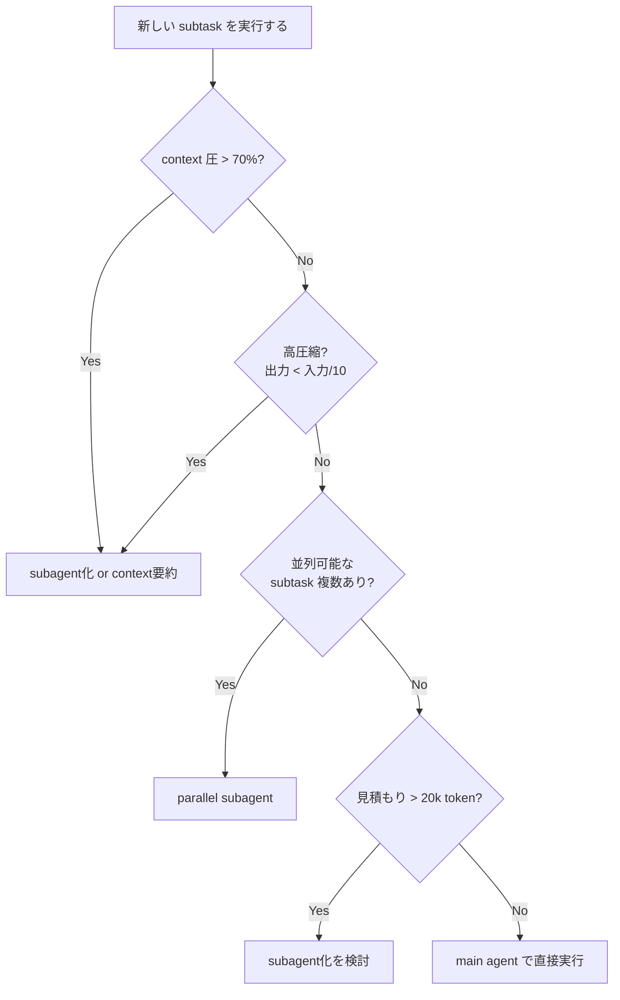

## TL;DR

- Anthropic の [Building Effective Agents](https://www.anthropic.com/engineering/building-effective-agents) は agent 設計の5パターンを提示している
- しかし「どのパターンを、どの粒度で適用するか」を決める実務的な閾値は読者任せになっている
- 本記事は **context 予算** の観点で4軸フレームワーク（context圧・圧縮率・独立性・並列性）を提示し、5パターンとの対応関係を示す
- 最強のシグナルは **圧縮率**：input >> output となる subtask は subagent 化の最有力候補

## はじめに

Anthropic の [Building Effective Agents](https://www.anthropic.com/engineering/building-effective-agents)（2024年末公開）は、AIエージェント設計の事実上の標準教科書になっている。整理されている5パターンは次の通り。

| パターン | 何をするか |
| --- | --- |
| Prompt chaining | タスクを直列ステップに分解し、各段階で LLM 呼び出し |
| Routing | 入力を分類して、専門化された下流に振り分け |
| Parallelization - Sectioning | タスクを独立した部分に分割して並列実行 |
| Parallelization - Voting | 同じタスクを複数回走らせて結果を合議 |
| Orchestrator-Workers | orchestrator が動的にタスクを分解して worker に委譲 |
| Evaluator-Optimizer | 生成 ↔ 評価のループで品質を上げる |

これらは **「どんな形にするか (HOW)」** の語彙を提供してくれる。一方で、実務でエージェントを組んでいると次の問いにぶつかる。

> このタスク、main agent でそのまま処理する？それとも subagent に投げる？
> 投げるとして、何 token 超えたら投げる？

つまり **「いつ・どの粒度で分けるか (WHEN / HOW MUCH)」** の判断軸が要る。本記事ではこれを **context 予算** の観点から構造化し、Anthropic の5パターンの補完として読めるように整理する。

なお本記事の主張は私の実務上の経験則ベースで、定量的に証明されたものではないことを最初に断っておく。

## そもそも、なぜ context が問題になるのか

「main agent で全部やれば一番シンプルでは？」という疑問への答えを先に整理する。

### token cost が線形以上に積み上がる

エージェントが N ターン回るとき、各ターンの入力 token はそれまでの履歴を全部含む。prompt caching で前半部分はキャッシュされるが、ツール結果が追記されるたびに tail は変化し、そこから先のキャッシュは無効化される。

ざっくり、**N ターン後の累積入力 token は O(N²) のオーダー**に近づく。30 ターンと 100 ターンで料金が10倍以上違っても驚かない。

### context rot による品質劣化

長い context を与えるとモデルの注意が dilute する現象がよく知られている。

- **lost-in-the-middle**：中盤の情報が無視されやすい
- **tool call 精度の低下**：経験的に、context が膨らむにつれて tool 選択ミス・引数ミスが増える
- **古い発言への引きずられ**：途中で方針転換しても過去の自分の発言を真として扱ってしまう

200k context のモデルでも、実質的にエージェントが「健全に」動ける range は経験的に 20k〜80k 程度だと感じている。

### デバッグが困難になる

長い context で agent が暴走したとき、どこで何が起きたかをログから追うのが非常に辛い。短い context で subagent が完結していれば、その入出力だけ見ればよく、デバッグ単位として優秀。

### cache hit rate が下がる

main agent でツール結果が大量に追記されると、それより後ろの prompt はキャッシュ無効化される。subagent に分業すれば main agent の cache prefix を保てる。地味だが本番運用では効いてくる。

## ナイーブな案：k threshold

最もシンプルなルールはこれ。

> **「1 agent が扱う context が値 k を超えるなら subagent に投げる」**

出発点としては悪くない。k = 50,000 token とでも決めておけば、「context が膨らみすぎる前に分業する」という安全弁になる。

ただし実際にやってみると穴がある。

- k 以下でも分割すべきケースがある（並列性が高くて全体時間が劇的に縮むとき）
- k を超えても分割すべきでないケースがある（タスクが密結合で、subagent に渡しても結局往復が増える）
- k の最適値はモデル・タスクで変わる

k threshold は **1次近似** であって、本当はもう少し多次元で判断したい。

## 4軸フレームワーク

実務で使っている判断軸は以下の4つ。

### 軸1：Context圧（現在の context 使用率）

「今 main agent がどれくらい context を使っているか」。

| 使用率 | 状態 | 行動 |
| --- | --- | --- |
| ~ 30% | 余裕 | 分割の必要性は低い |
| 30% ~ 50% | 普通 | 次の大きい task は分割を検討 |
| 50% ~ 70% | 警戒 | 圧縮可能なものは積極的に subagent 化 |
| 70% ~ | 緊急 | これ以上 main に load しない。要約 → 新コンテキスト化も検討 |

未来予測も含む。今 30% でも、これから読む予定のドキュメントが大きいなら早めに分割する。

### 軸2：圧縮率（input / output ratio）

**ここが一番重要な軸だと考えている。**

subtask の「入力（読む量）」に対して「出力（main agent に返す情報量）」がどれくらい小さくなるか？

**高圧縮（1/10 以下）：subagent 向き**

- 20個のファイルを読んで「該当する1ファイルの名前」を返す
- 巨大なログを読んで「エラーの根本原因を1段落」で返す
- 長い PDF を読んで「該当条項の有無」だけ返す

**低圧縮（1/2 程度）：subagent 化のうま味薄い**

- 文書を翻訳する（入出力ほぼ同量）
- コードを別言語に書き換える

圧縮率が高いほど、subagent 化することで main agent が受け取る情報量を小さく抑えられる。これが context 予算の節約に直結する。**「読む量 >> 返す量」のタスクを見たら、ほぼ反射で subagent 化を検討していい。**

### 軸3：独立性（subtask が main agent と切り離せるか）

subtask が明確な「入力 → 出力」関数として記述できるか？

**独立：subagent 化が容易**

- 「この URL を読んで要約せよ」（入力 = URL、出力 = 要約）
- 「このディレクトリで認証関連のコードを探せ」

**密結合：subagent 化が困難**

- 「ユーザーの好みを踏まえて提案を出せ」（main agent の会話履歴が必要）
- 「前のステップの結果を見ながら次を決める」（試行錯誤を含む）

独立性が低いタスクを subagent に投げると、main agent が「subagent に必要な前提を全部詰め込んだ巨大プロンプト」を作る羽目になり、結局 context 圧が上がる。本末転倒。

### 軸4：並列性

複数の subtask を並列実行できるか？

並列にできるなら、総 token 消費が main agent で直列にやるより多くても、**wall-clock 時間が劇的に短くなる**ので価値が高い。ユーザー体感としては「速い」こと自体が品質の一部。

- 並列可：5ファイルを同時に5つの subagent で読む → 1/5 の時間
- 並列不可：subtask B の結果が subtask A に依存する → 並列化できない

## 判断フローチャート

上記4軸を実際の意思決定に落とすとこうなる。

簡略化されているが、実務ではこの順序で考えると判断がブレない。

## Anthropic 5パターンと4軸の対応

ここからが本記事のもうひとつの主張。**4軸は「どのパターンを採るべきか」を導出するレンズになる。**

### Prompt chaining

- 軸3（独立性）が**低い**：各ステップが前の出力を必要とする
- 軸1（context圧）の累積に注意：途中で中間成果物を要約する設計が有効
- 適用例：複雑な文書生成（plan → outline → draft → polish）

### Routing

- 軸3（独立性）が**高い**：入力種別ごとに完全に独立した流れになる
- 分岐後は specialist の context を新規スタートできるので予算管理がしやすい
- 適用例：問い合わせ種別が多様な顧客対応 bot

### Parallelization - Sectioning

- **軸2（圧縮率）× 軸4（並列性）** の組み合わせが効く典型
- 各 worker が高圧縮で結果を返すと、main agent の context を抑えつつ wall-clock も短縮
- 適用例：大量ファイル横断検索、複数ドキュメント比較

### Parallelization - Voting

- これは context 予算というより **信頼性目的** のパターン
- コスト増を許容して精度を上げる。本記事の主軸からは少し外れる
- 適用例：高 stakes 判断（医療判断補助、金融リスク評価、コードの安全性レビュー等）

### Orchestrator-Workers

- 軸2（圧縮率）の高いサブタスクが多いときの汎用解
- orchestrator を薄く保ち、workers に重い読み込みを担当させる
- 事前に subtask が決まらず動的分解が必要なケース向き
- 適用例：Anthropic の coding agent（GitHub issue を複数ファイル横断で解決）

### Evaluator-Optimizer

- 軸3（独立性）が**低い**：評価結果を見て生成を改善する反復構造
- context が累積しがちなので、各反復で過去出力をどこまで保持するか設計が要る
- 適用例：翻訳の品質改善、コードレビューを通した実装の洗練

**4軸を先に見れば、それぞれの状況にどのパターンが向くかが自然に決まる。** 逆に、パターンを先に選んで4軸を無視すると、適用場面を間違える（典型的には「とりあえず orchestrator-workers」をやってコストが膨らむ）。

## アンチパターン

### 1. 細分化しすぎ（micro-subagent hell）

1ファイル読むごとに subagent を立てると、立ち上げの system prompt や tool 定義のオーバーヘッドが累積する。**subagent には「立ち上げコスト」がある**ことを忘れない。

経験則：**10 tool call 未満で終わる作業を subagent 化しても、得が薄い**ことが多い。

### 2. 再帰的 subagent の暴発

subagent がさらに subagent を呼ぶ設計は、コストが指数的に膨らみがち。「うちのエージェント深さ無限です」みたいな demo はカッコいいけど、本番運用で財布が死ぬ。

- 階層は **最大2階層**までを基本に設計する
- 再帰を許す場合は明示的な深さ制限を入れる

### 3. 共有 context が必要なのに分割

ユーザーの長い会話履歴・好みを踏まえた判断が必要なタスクで、それを subagent に渡そうとすると、結局会話履歴を要約してプロンプトに詰める作業が発生する。情報損失も起きる。

→ 主観的判断・人格的判断が必要なタスクは main agent に残す。

### 4. 出力検証のない subagent

subagent の出力をそのまま信用して main agent が次のステップに進むと、subagent の幻覚が複利で効いてくる。**subagent の出力は構造化された形式（JSON、決まった見出し）で返させ、main agent が validation を挟む**設計が望ましい。

## 簡易コスト試算

具体的な感覚をつかむためのざっくり例（数字はイメージ）。

### ケースA：20 個のファイルから1つだけ目的のものを探す

- 全ファイル合計 = 100k token、目的の答え = 100 token
- **main agent で直接**：100k token を main の context に乗せる → 以後すべてのターンで 100k 分の入力コストが乗り続ける
- **subagent に委譲**：subagent が 100k 読んで結果 100 token を返す → main agent には 100 token しか乗らない

→ **後続のターンが多いほど、subagent 化のリターンが効いてくる**。これは sectioning でも orchestrator-workers でも共通の構造。

### ケースB：文書を別の文体に書き換える

- 入力 = 5k token、出力 = 5k token
- 圧縮率 ≈ 1（圧縮できない）
- subagent 化しても main agent の context にはどのみち 5k は戻ってくる

→ 分割するうま味は薄い。直接 main agent でやるか、prompt chaining の1段として設計する。

## で、結局 k はいくつにする？

冒頭で示した「k threshold」に戻ると、現在の私の目安は次の通り（あくまで出発点）。

| モデル帯 | k の目安 |
| --- | --- |
| Claude Sonnet系（200k context） | 30,000 token |
| Haiku / 軽量モデル | 10,000 token |
| GPT-4o系（128k context） | 20,000 token |

ただし上述のとおり、これは1次近似であって、**圧縮率・独立性・並列性で常に補正する**。「30k 超えたから機械的に subagent」ではなく、「30k 超えそうな subtask が高圧縮なら subagent、低圧縮なら main で覚悟を決める」という運用。

## まとめ

- Anthropic [Building Effective Agents](https://www.anthropic.com/engineering/building-effective-agents) の5パターンは **HOW（どんな形にするか）** を提供
- 本記事の4軸（context圧・圧縮率・独立性・並列性）は **WHEN / WHETHER（いつ・どこから分けるか）** を提供
- 両者は補完関係：パターン選択の前段に4軸の評価を置くと、判断がブレない
- 最強のシグナルは **圧縮率**：input >> output の subtask は subagent 化の最有力候補
- 階層は2階層まで / 10 tool call 以上の作業を任せる / 主観判断は main に残す / 出力は構造化形式で受けて validate する

実務での経験則は人それぞれだと思うので、皆さんの「これは subagent 化する/しない」の判断ルールもぜひコメントで教えてください。
