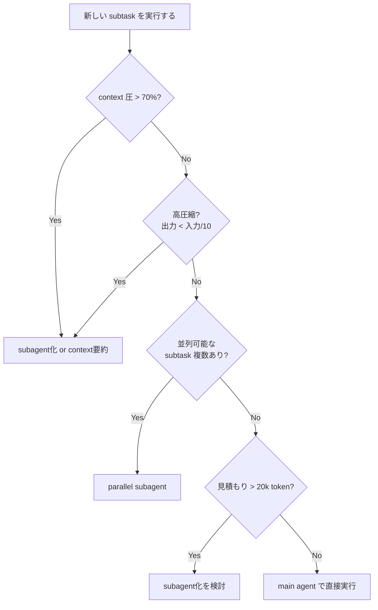

## TL;DR

- Anthropic の [Building Effective Agents](https://www.anthropic.com/engineering/building-effective-agents) は agent 設計の5パターンを提示しているが、「どのパターンを、どの粒度で適用するか」の閾値は読者任せ
- 本記事では **context 予算** の観点から4つの判断軸（context圧・圧縮率・独立性・並列性）を整理し、5パターンとの対応を示す
- 一番効くシグナルは **圧縮率**。input に対して output が大幅に小さくなる subtask は subagent に切り出す最有力候補

## はじめに

Anthropic の [Building Effective Agents](https://www.anthropic.com/engineering/building-effective-agents)（2024年末公開）は、AIエージェント設計における事実上の標準教科書になった。そこで整理されている5パターンはこうだ。

| パターン | やること |
| --- | --- |
| Prompt chaining | タスクを直列ステップに分解し、各段階で LLM を呼ぶ |
| Routing | 入力を分類して、専門化された下流に振り分ける |
| Parallelization - Sectioning | タスクを独立した部分に分割して並列実行する |
| Parallelization - Voting | 同じタスクを複数回走らせて結果を合議する |
| Orchestrator-Workers | orchestrator が動的にタスクを分解し worker に委譲する |
| Evaluator-Optimizer | 生成と評価のループで品質を上げる |

これらは **「どんな形にするか (HOW)」** の語彙としてよくできている。ただ、実務でエージェントを組んでいるとこういう問いにぶつかる。

> このタスク、main agent でそのまま処理していい？ subagent に投げたほうがいい？
> 投げるとして、何 token 超えたら投げる？

要するに **「いつ・どの粒度で分けるか (WHEN / HOW MUCH)」** の判断軸が足りない。本記事ではこの問いを **context 予算** の観点から構造化して、5パターンの補完として使えるように整理してみる。

先に断っておくと、ここで書く内容は自分の実務上の経験則がベースであり、定量的に証明されたものではない。

## なぜ context が問題になるのか

「main agent で全部やれば一番シンプルじゃないか」という疑問はもっともなので、先にそこを片づける。

### token コストが線形以上に積み上がる

エージェントが N ターン回ると、各ターンの入力 token にはそれまでの履歴がまるごと含まれる。prompt caching で前半部分はキャッシュが効くが、ツール結果が追記されるたびに末尾が変わり、それより後ろのキャッシュは無効化される。

大ざっぱに言って、**N ターン後の累積入力 token は O(N²) のオーダー**に近づく。30 ターンと 100 ターンで料金が10倍以上開いても不思議はない。

### context が長くなると品質が落ちる

長い context を渡したときにモデルの注意が散漫になる現象はよく知られている。

- **lost-in-the-middle**：context の中盤に置かれた情報が無視されやすい
- **tool call 精度の低下**：context が膨らむにつれて tool 選択ミスや引数ミスが増える（経験的にだが）
- **過去の発言に引きずられる**：途中で方針転換しても、過去の自分の発言をそのまま前提として扱い続ける

200k context のモデルであっても、エージェントが安定して動ける範囲は体感で 20k〜80k 程度だと思っている。

### デバッグしにくい

長大な context の中で agent が暴走すると、どこで何が起きたのかログから追うのがとにかく辛い。短い context で subagent が完結していれば、その入出力だけ見ればいいのでデバッグの単位として扱いやすい。

### cache hit rate が下がる

main agent のツール結果が大量に追記されると、それより後ろの prompt のキャッシュが効かなくなる。subagent に仕事を分ければ main agent 側の cache prefix が保たれる。地味だが本番運用ではじわじわ効いてくるポイントだ。

## ナイーブな案：k threshold

最もシンプルなルールはこう。

> **「1 agent の context が k token を超えたら subagent に投げる」**

出発点としては悪くない。k = 50,000 token とでも決めておけば、context が膨らみすぎる前に分業するための安全弁にはなる。

ただ、実際に運用すると穴が見えてくる。

- k 以下でも分割したほうがいいケースがある（並列性が高くて全体の所要時間が大幅に縮むとき）
- k を超えても分割すべきでないケースがある（タスクが密結合で、subagent に渡しても結局やりとりが増えるだけ）
- k の最適値はモデルやタスクの性質で変わる

k threshold はあくまで **1次近似** であって、実際にはもう少し多次元で判断したい。

## 4軸フレームワーク

自分が実務で使っている判断軸は次の4つだ。

### 軸1：Context圧（いま context をどれくらい使っているか）

main agent の context 使用率を見て、どう動くかを決める。

| 使用率 | 状態 | とる行動 |
| --- | --- | --- |
| ~ 30% | 余裕あり | 無理に分割しなくていい |
| 30% ~ 50% | ふつう | 次に大きいタスクが来たら分割を検討 |
| 50% ~ 70% | 警戒域 | 圧縮できるものは積極的に subagent へ出す |
| 70% ~ | 危険域 | これ以上 main に載せない。要約して新しい context を起こすことも視野に入れる |

現在値だけでなく、先の見通しも加味する。いま 30% でも、これから読むドキュメントが大きいとわかっているなら早めに分割しておく。

### 軸2：圧縮率（input に対して output がどれだけ小さくなるか）

**4軸の中で一番重要だと考えている。**

subtask が「読む量」に対して「main agent に返す情報量」をどれだけ圧縮できるか。

**高圧縮（1/10 以下）なら subagent 向き**

- 20個のファイルを読んで「該当する1ファイルの名前」だけ返す
- 巨大なログを読んで「エラーの根本原因を1段落」にまとめる
- 長い PDF を読んで「該当条項があるかどうか」だけ答える

**低圧縮（1/2 程度）だと subagent に出す旨みが薄い**

- 文書を翻訳する（入力と出力がほぼ同じ量）
- コードを別言語に書き換える

圧縮率が高いほど、subagent 化によって main agent が受け取る情報量を小さく保てる。これが context 予算の節約に直結する。**「読む量 >> 返す量」になっているタスクを見つけたら、ほぼ反射的に subagent 化を検討していい。**

### 軸3：独立性（subtask を main agent から切り離せるか）

subtask が「入力を受け取って出力を返す関数」として綺麗に記述できるかどうか。

**独立性が高い → subagent に出しやすい**

- 「この URL を読んで要約してくれ」（入力 = URL、出力 = 要約文）
- 「このディレクトリから認証まわりのコードを探してくれ」

**密結合 → subagent 化が難しい**

- 「ユーザーの好みを踏まえて提案を出してくれ」（main agent の会話履歴が必要）
- 「前のステップの結果を見ながら次の手を考えてくれ」（試行錯誤が伴う）

独立性が低いタスクを無理に subagent に投げると、main agent が「subagent に渡すための前提情報を全部詰め込んだ巨大プロンプト」を組み立てる羽目になる。結局 context 圧が上がるので本末転倒だ。

### 軸4：並列性（複数の subtask を同時に走らせられるか）

並列にできるなら、トータルの token 消費が直列より多くなったとしても **実時間が大幅に縮む** ので価値がある。ユーザーの体感としては「速い」こと自体が品質の一部だ。

- 並列可：5ファイルを5つの subagent で同時に読む → 実時間は 1/5
- 並列不可：subtask B の入力が subtask A の出力に依存する → 直列にやるしかない

## 判断フローチャート

4軸を実際の意思決定に落とし込むとこうなる。

だいぶ簡略化してはいるが、この順序で考えると判断がブレにくい。

## Anthropic の5パターンと4軸の対応

ここからが本記事のもうひとつの主張になる。**4軸を先に評価すれば、どのパターンを採るべきかが自然と決まる。**

### Prompt chaining

- 軸3（独立性）が**低い**。各ステップが前の出力に依存する
- 軸1（context圧）が累積で増えやすいので、途中の中間成果物を要約しながら進める設計が有効
- 例：複雑な文書生成（plan → outline → draft → polish）

### Routing

- 軸3（独立性）が**高い**。入力種別ごとに完全に独立した流れになる
- 分岐先では context を新規に起こせるので予算管理がしやすい
- 例：問い合わせ種別が多岐にわたる顧客対応 bot

### Parallelization - Sectioning

- **軸2（圧縮率）と軸4（並列性）** の掛け算が効く典型
- 各 worker が高圧縮で結果を返せば、main agent の context を抑えつつ実時間も縮まる
- 例：大量ファイルの横断検索、複数ドキュメントの比較

### Parallelization - Voting

- context 予算というよりは **信頼性を上げるため** のパターン
- コスト増を許容して精度を稼ぐ。本記事の主軸からは少し外れる
- 例：高リスク判断（医療判断の補助、金融リスク評価、コードの安全性レビューなど）

### Orchestrator-Workers

- 軸2（圧縮率）の高い subtask が多いときの汎用解
- orchestrator を薄く保ち、重い読み込みは worker に任せる
- subtask を事前に列挙できず、動的に分解していく必要があるケース向き
- 例：Anthropic の coding agent（GitHub issue を複数ファイルにまたがって解決する）

### Evaluator-Optimizer

- 軸3（独立性）が**低い**。評価結果をもとに生成を改善する反復構造
- 反復のたびに context が積み上がるので、過去の出力をどこまで保持するかの設計が要る
- 例：翻訳の品質改善、コードレビューを繰り返して実装を磨くフロー

**4軸を先に見ておけば、状況に応じてどのパターンが合うかは自然に絞り込める。** 逆に、パターンありきで4軸を無視すると適用場面を間違えやすい。よくあるのは「とりあえず orchestrator-workers にしておこう」でコストが膨らむパターンだ。

## アンチパターン

### 1. 細分化しすぎ（micro-subagent hell）

1ファイル読むたびに subagent を立てるような設計だと、system prompt や tool 定義を毎回送るオーバーヘッドが積み重なる。subagent には「起動コスト」があることを忘れてはいけない。

経験的に、**10 tool call 未満で終わるような作業は subagent 化しても割に合わない**ことが多い。

### 2. 再帰的 subagent の暴走

subagent がさらに subagent を呼ぶ構造にすると、コストが指数的に膨れ上がりやすい。「うちのエージェント、再帰の深さに制限ありません」というデモは見栄えがいいが、本番で請求書を見て青ざめることになる。

- 基本は **最大2階層** までに留める
- 再帰を許容する場合は、明示的に深さの上限を設ける

### 3. 共有 context が必要なタスクの無理な分割

ユーザーとの長い会話履歴や好みを踏まえた判断が求められるタスクを subagent に渡そうとすると、結局その会話履歴を要約してプロンプトに詰め込む作業が発生する。情報の欠落も避けられない。

主観的な判断や、ユーザーとの対話の文脈に依存する判断は main agent に残すのが無難だ。

### 4. 出力を検証しない subagent

subagent の出力をそのまま信用して main agent が次のステップに進むと、subagent のハルシネーションが複利で効いてくる。subagent の出力は構造化した形式（JSON や決まった見出し）で返させて、main agent 側で妥当性を確認する設計にしておきたい。

## 簡易コスト試算

感覚をつかむために、ざっくりした例を2つ挙げる。数字はイメージだと思って読んでほしい。

### ケースA：20 個のファイルから目的のものを1つ探す

- 全ファイルの合計 = 100k token、求める答え = 100 token
- **main agent で直接やる場合**：100k token が main の context に載る。以降のターンすべてでこの 100k 分の入力コストが乗り続ける
- **subagent に任せる場合**：subagent が 100k を読んで結果の 100 token だけ返す。main agent には 100 token しか載らない

後続のターンが多いほど、この差は広がる。sectioning でも orchestrator-workers でも、この構造は共通だ。

### ケースB：文書を別の文体に書き換える

- 入力 = 5k token、出力 = 5k token
- 圧縮率はほぼ 1（圧縮しようがない）
- subagent に出しても main agent の context にはどのみち 5k 戻ってくる

この場合は分割する旨みがない。main agent で直接やるか、prompt chaining の1ステップとして扱えばいい。

## で、結局 k はいくつにするのか

冒頭の k threshold に立ち戻ると、いま自分が使っている目安はこのあたりだ（あくまで出発点として）。

| モデル帯 | k の目安 |
| --- | --- |
| Claude Sonnet系（200k context） | 30,000 token |
| Haiku / 軽量モデル | 10,000 token |
| GPT-4o系（128k context） | 20,000 token |

ただし繰り返しになるが、これは1次近似にすぎない。**圧縮率・独立性・並列性で常に補正をかける。** 「30k を超えたから機械的に subagent」ではなく、「30k を超えそうな subtask が高圧縮なら subagent、低圧縮なら main で腹をくくる」という判断になる。

## まとめ

- Anthropic の [Building Effective Agents](https://www.anthropic.com/engineering/building-effective-agents) の5パターンは **HOW（どんな形にするか）** を与えてくれる
- 本記事の4軸（context圧・圧縮率・独立性・並列性）は **WHEN / WHETHER（いつ・そもそも分けるのか）** の判断材料を与える
- 両者は補完関係にあり、パターン選択の手前に4軸の評価を挟むと判断がブレにくくなる
- 一番効くシグナルは **圧縮率**。input >> output の subtask は subagent 化の最有力候補
- 実運用上のガードレール：階層は2つまで / 10 tool call 以上の作業を任せる / 主観判断は main に残す / 出力は構造化して validate する

自分の経験則を書いたが、当然ほかのやり方もあると思う。「うちではこういう基準で subagent に切り出している」という話があれば、ぜひコメントで教えてほしい。
