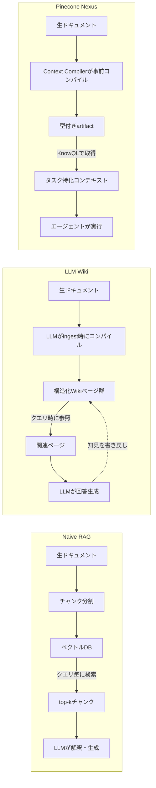

[健適文化](https://kenteki.org)という会社をやっています。社内ドキュメントが散らかって検索できない、AIに聞いてもまともな答えが返ってこない、そういう課題に対して、会社のナレッジベースをゼロから構築するお手伝いをしています。この記事はその過程で得た知見をまとめたものです。

## 先に結論

社内ドキュメントをベクトルDBに突っ込んでRAGを組んだのに精度が出ない、という問題の原因は「入れ方」にあります。生のドキュメントをそのまま渡すのではなく、LLMが消化できる粒度まで段階的に加工してから渡す。Anthropicがコンテキストエンジニアリングの文脈でprogressive disclosureと呼んでいる設計思想で、Karpathy氏の提唱するLLM WikiもPineconeのNexusも、突き詰めるとここに収束します。

実際に自分のクラウドストレージ（約20万ファイル）で試したところ、体感レベルでは検索精度が大きく向上しました。

## この記事で扱うこと

| 項目 | 内容 |
|------|------|
| 対象読者 | RAGを組んだが精度に悩んでいるエンジニア |
| 扱う手法 | Karpathy氏のLLM Wiki、PineconeのNexus |
| 実践環境 | 個人のクラウドストレージ（約20万ファイル） |
| 得られた結果 | 体感での検索精度向上、有料サービスより安価に実現 |

## なぜ「ただ突っ込むだけ」では精度が出ないのか

社内ドキュメントをベクトルDBに入れてRAGを組んだのに、まともな回答が返ってこない。そんな経験をされた方は少なくないのではないでしょうか。私自身もそうでした。

原因は大抵、入れるドキュメントの選び方ではなく、入れ方にあります。よくある失敗パターンを見てみます。

長いドキュメントをそのまま投入するケース。たとえばこんなチャンクが生まれます。

```
第3章 システム設計
3.1 概要
本システムは前章で述べた要件に基づき...
```

「前章で述べた要件」が何なのか、このチャンクだけではわかりません。context依存の表現がそのまま残っているからです。

逆に分割しすぎるケースもあります。

```
- 認証にはJWTを使用する
```

これだけ取り出しても、何のシステムの、どのエンドポイントの認証なのかが消えています。

もうひとつ厄介なのが、同じ概念が複数のドキュメントに散らばっているパターンです。デプロイ手順が5つのファイルに分散していて、どれが最新かわからないままベクトルDBに入っている。LLMが矛盾した情報を拾ってくる原因になります。

## Karpathy氏のLLM Wikiという考え方

Andrej Karpathy氏が2026年4月にGitHub Gistで公開したLLM Wikiという設計パターンがあります。LLMにはLLM向けの情報の渡し方がある、という考え方を具体的な仕組みに落とし込んだものです。

人間向けのドキュメントは前から順に読む想定で書かれています。「前章で述べた通り」「上記の要件に基づき」といった表現が当たり前に出てくる。読み手がcontextを持っている前提だからです。

LLMはそうではありません。ドキュメントをチャンクという断片に分割して処理します。前後のつながりは基本的に失われる。だから、どのチャンクを単独で取り出しても意味が通じるように書かれていなければ、検索で正しい断片を拾えても回答の精度は上がりません。

### 三層アーキテクチャ

Karpathy氏が提案しているのは、生のドキュメントをそのまま検索対象にするのではなく、一度LLMに読ませて「コンパイル」し、整理されたWikiページ群として保持するという構造です。彼のGistで公開されている設計では、三つの層に分かれています。

| 層 | 役割 | LLMの権限 |
|------|------|------|
| 第一層：raw | 元のドキュメントをそのまま保管 | 読み取り専用 |
| 第二層：Wiki本体 | LLMが生成・保守する構造化されたページ群 | 完全に編集可能 |
| 第三層：スキーマ | Wikiの構造規約や運用ルール | 人間が管理 |

初期のRAG、いわゆるNaive RAGはクエリのたびに生ドキュメントを検索してその場で回答を合成する構成でした。2023年以降、Self-RAGやCRAGのような自己修正型、AnthropicのContextual Retrievalのようにチャンクにcontextを付与して検索失敗率を最大67%削減する手法など、RAG自体も大きく進化しています。ただ、こうしたAdvanced RAGでもクエリ時に検索・解釈する構造は変わりません。LLM Wikiはここを根本から変えます。ソースを追加した時点で知識を構造化し、相互リンクされたページ群として蓄積する。回答はすでに整理された知識の上に組み立てられるので、同じ質問を繰り返しても毎回ゼロから探し直す必要がありません。知識が積み重なっていく仕組みです。

### ingest / query / lintの三操作

運用はingest、query、lintの三つの操作で回します。

ingestは新しいソースを取り込む操作で、LLMがドキュメントを読み、要約ページを作り、関連するエンティティページを更新し、インデックスに追記します。ひとつのソースが10〜15のページに影響することもあります。queryはWiki内のページを検索して回答を合成する操作で、参照元を明示しながら答えを返します。lintは定期的なメンテナンスで、矛盾の検出、古くなった記述の確認、孤立ページの発見などをLLMに任せます。

## Pinecone Nexusも同じ方向を指している

こうした問題は、Pineconeが最近公開したブログ記事でも指摘されています。彼らの主張は端的で、モデルを良くしてもエージェントは賢くならない、知識の渡し方を変えなければ駄目だ、というものです。

Pineconeが発表したNexusという仕組みでは、クエリ時にドキュメントを検索するのではなく、事前にソースデータを「コンパイル」してタスク特化型のartifactとして用意します。エージェントが受け取るのは生のドキュメントではなく、型付けされ、出典が明示され、タスクに合わせて構造化された知識です。Karpathy氏のgistとは実装のレイヤーが違いますが、「検索時に毎回生ドキュメントを解釈させるのは無駄だ」という根っこの考え方は同じです。

| | Naive RAG | Advanced RAG | LLM Wiki | Pinecone Nexus |
|------|------|------|------|------|
| 知識の加工タイミング | クエリ時（毎回） | クエリ時（毎回、高度な前処理付き） | ソース追加時（一度） | コンパイル時（一度） |
| LLMに渡すもの | 生のチャンク | context付きチャンク＋リランキング結果 | 構造化されたWikiページ | タスク特化のartifact |
| 知識の蓄積 | しない | Agentic RAGではメモリ層あり | する（ページ間リンク） | する（artifact再利用） |
| 同じ質問への再回答 | 毎回検索し直す | 毎回検索し直す（精度は高い） | 既存ページから即答 | 既存artifactから即答 |

処理の流れを図にすると、違いがはっきりします。



## 実践で効いた2つの原則

こうした失敗パターンとその背景を踏まえて、実践の中でたどり着いた設計の原則があります。チャンクの自己完結性（単独で意味が通じること）は前提として、その先で差がついたのは以下の2点でした。

### 原則1：粒度の統一

1チャンクに1概念だけを入れます。ログイン処理の概要とパスワードリセットの仕様を同じチャンクに入れると、検索で片方を狙って引いたときにもう片方がノイズになります。目安は1チャンクあたり200〜400トークンくらいです。

### 原則2：contextの明示

チャンクの冒頭に、何について、どのシステムの、いつ時点の情報かを書いておきます。

```
[対象：受発注API v2] 認証仕様

このAPIはBearerトークン認証を使用する（2024年3月以降の仕様）。
トークンの有効期限は24時間。リフレッシュエンドポイントは /auth/refresh。
```

## 整理作業自体をLLMにやらせる

実践で一番効いたのは、この整理作業自体をLLMにやらせることでした。

Google Drive、Notion、Confluenceなどに散らばっている既存ドキュメントをLLMに渡して、ナレッジベース用に再構成させます。Karpathy氏のingest操作を簡易的に再現する形です。プロンプトはこんな形になります。

```
以下のドキュメントを、LLMが検索・参照しやすいナレッジベース用に再構成してください。

条件：
- 各チャンクは200〜400トークン程度
- 各チャンクは文脈なしで単独で意味が通じること
- 固有名詞・システム名・バージョン情報は省略しない
- 同じ概念を複数チャンクに重複させない
- 各チャンクの冒頭に [対象：XXX] 形式のラベルをつける

ドキュメント：
{document}
```

人手でやるより速いですし、品質も安定します。

## 実際にやってみた結果

自分のクラウドストレージで実際に試しました。約20万ファイル、よくある「散らかったストレージ」そのものです。フォルダ構造は一応あるが形骸化していて、同じ内容のファイルが複数バージョン存在する。仕事のメモと個人の調べ物とプロジェクト資料が混在し、命名規則もないから開かないと中身がわからない。何年も触っていない古いファイルも大量に残っている。心当たりがある方は多いのではないでしょうか。

結果として、RAGのヒット率はそのまま突っ込んでいたときと比べて体感で大きく上がりました。「あのファイルどこだっけ」と探し回る時間がほぼなくなっています。有料の検索サービスを契約するより安く、自分の用途に合った形で実現できました。

ただし「体感で上がった」は定量的な評価ではありません。本来はRAGASやDeepEvalのようなフレームワークで、faithfulnessやcontext precisionを測定すべきです。30〜50問程度のゴールデンセットを用意して評価基盤を先に作るのが正しい順序で、これは今後の課題として残っています。

## よくある誤解

ChromaDBやPineconeを使えば解決するという期待がありますが、ベクトルDBにハイブリッド検索やリランキングの機能がどれだけ揃っていても、入れるチャンクの質が低ければ精度は出ません。Pinecone自身がNexusで「ベクトルDBの上にさらに知識をコンパイルする層が要る」と言い始めているのは象徴的です。NexusはベクトルDBを置き換えるのではなく、その上に載るadditive（追加的）な層として設計されています。

ドキュメントが多いほど良いという思い込みもあります。むしろ古い情報、重複、矛盾が精度を下げます。整理して不要なものを削ることこそが精度向上の本丸です。

一度作れば終わりというわけでもありません。ドキュメントが更新されるたびに対応するチャンクも更新する仕組みが必要です。ナレッジベースは運用し続けるものです。Karpathy氏の設計にlint操作が組み込まれているのも、放置すれば劣化するという前提に立っているからです。

## このアプローチの限界

ここまで書いておいて言うのもどうかと思いますが、唯一の方法はありません。

LLM Wikiにも弱点はあります。LLMがWikiページを生成する以上、事実と異なる記述が紛れ込む可能性は消えません。厄介なのは、一度Wikiに書き込まれた誤りが後続のingestやqueryで「正しい知識」として参照され、定着してしまうことです。通常のRAGならハルシネーションはチャットの応答で閉じますが、LLM Wikiでは知識ベース自体が汚染されます。lintで検出できる場合もありますが、lintを実行するのもLLMなので、同じ種類の誤りは見逃しやすい。

コストの問題もあります。ひとつのソースをingestするたびに10〜15ページが更新されるため、50本の論文を取り込むと100〜200回のAPI呼び出しが発生します。個人の知識ベースなら許容範囲ですが、企業規模で継続的に回すとなるとトークン消費は膨らみます。Wikiが数百ページに成長するとLLMが全体を見渡せなくなり、ページ間の微妙な関連性を拾えなくなるという壁もあります。

ただ、これらは設計で緩和できます。コストについては、ingestの影響範囲をドメイン別にシャーディングすることで、1回のingestが触れるページ数を制御できます。全ページを毎回走査する必要はなく、index.mdのカテゴリ情報をもとに関連ドメインだけを更新対象にすれば、100〜200回が20〜30回に収まります。コンテキストウィンドウの壁については、Wiki自体を階層化する手が使えます。各ドメインに要約ページを置き、クエリ時にはまず要約層を検索して関連ドメインを特定し、そのドメイン内の詳細ページだけをコンテキストに入れる。Wikiが1000ページになっても、1回のクエリで参照するのは20〜30ページに絞れます。要するに、Wiki内部にもprogressive disclosureの構造を作るということです。

Pinecone Nexusのようなコンパイル型のアプローチにしても、まだ出たばかりで実績が積み上がっているわけではありません。

そもそも、ドキュメントの規模が小さければこうした仕組みを組む必要すらないかもしれません。2026年現在、Claude Opus 4.7やGPT 5.5は100万トークンのコンテキストウィンドウを持っています。10万トークン以下のドキュメントセットであれば、long contextモデルにそのまま全文を渡す方がRAGを組むより速くて安い場合があります。LLM WikiやRAGを検討する前に、まずlong contextで足りないかを試す価値はあります。

## 結局、唯一の正解はない。でも共通点は見えてきた

ただ、うまくいっている手法には共通点があります。Karpathy氏のLLM Wikiは、生のドキュメントをraw層に置き、そこからWikiページを生成し、クエリ時にはWikiだけを参照する三層構造です。Pinecone Nexusは、ソースデータを事前にコンパイルしてタスク特化のartifactにし、エージェントにはartifactだけを渡します。やり方は違いますが、いくつかの原則を共有しています。

ひとつは、クエリ時に毎回生ドキュメントを解釈させるのではなく、取り込み時に知識をコンパイルしておくこと。もうひとつは、LLMに渡す知識に型・出典・構造を持たせること。Anthropicがコンテキストエンジニアリングのブログ記事で言うprogressive disclosureも同じ方向を指しています。エージェントが全情報を一度にコンテキストに詰め込むのではなく、必要な情報を必要なタイミングで段階的に取得し、理解をlayer by layerで組み立てていく。

唯一の正解の設計思想がある、と言い切れるほど話は単純ではありません。ドメインによって知識の性質は違います。ただ、規模の違いは「LLM Wikiが使えない理由」ではなく「Wiki内部の階層設計を変える理由」だと考えています。20万ファイルの個人ストレージなら単一のindex.mdで回せますが、数百万件の企業文書ならドメイン別のサブWikiに分割し、横断検索用のメタインデックスを置く。Karpathy氏の設計はMarkdownファイルとLLMだけで動くので、この種の構造変更が低コストで試せます。

結局のところ、やるべきことは3つだと思います。自分のドメインの知識がどういう性質を持っているか理解すること。早い段階で評価基盤を作ること。そして、必要最小限の複雑さから始めて段階的に育てること。流行りのアーキテクチャを追いかけるより、この順番を守る方がずっと確実です。

## 参考資料

- Andrej Karpathy「Deep Dive into LLMs like ChatGPT」（LLMの仕組みの全体像）
https://www.youtube.com/watch?v=dxq7WtWxi44
- Andrej Karpathy「How I Use LLMs」（LLMの実践的な使い方）
https://youtu.be/lqiwQiDglGk
- Andrej Karpathy「llm-wiki.md」（GitHub Gist、LLM Wikiの設計パターン本体）
https://gist.github.com/karpathy/442a6bf555914893e9891c11519de94f
- Pinecone「Pinecone Nexus: The Knowledge Engine for Agents」
https://www.pinecone.io/blog/knowledge-infrastructure-for-agents/
- Pinecone「Better Models Won't Save Your Agent」
https://www.pinecone.io/blog/introducing-nexus-knowledge-engine/
- Anthropic「Effective context engineering for AI agents」（progressive disclosureの出典）
https://www.anthropic.com/engineering/effective-context-engineering-for-ai-agents

---

この記事で書いたナレッジベースの構築、自社でやりたいけど手が回らないという方へ。[健適文化](https://kenteki.org)では、散らかったGoogle DriveやNotionを整理して、AIが使える形のナレッジベースに仕立てる仕事をしています。ご相談はXのDMからどうぞ。
